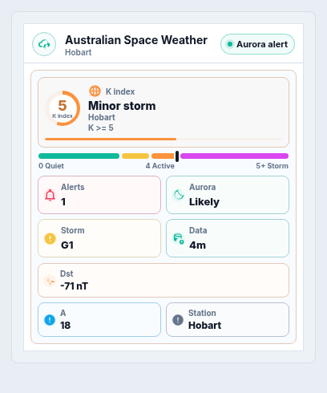
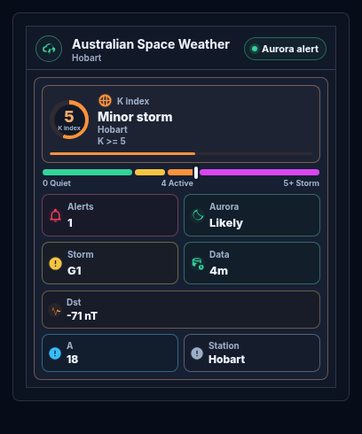
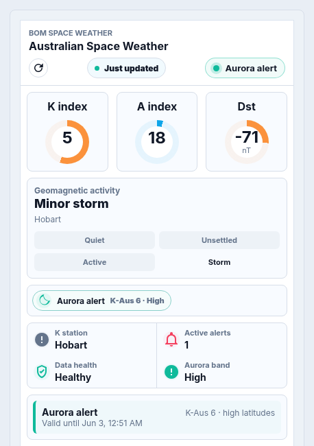
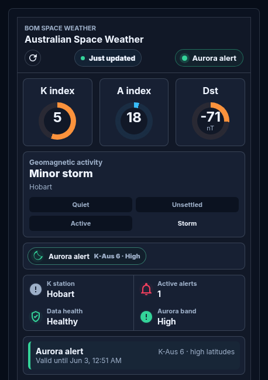

# AUS BOM Space Weather

Home Assistant integration and graphical Lovelace card for Australian Bureau of Meteorology Space Weather Services.

Use it to keep Australian space weather visible in Home Assistant: geomagnetic activity, aurora likelihood, magnetic storm state, active BOM notices, data freshness, and compact dashboard cards that work on desktop and mobile.

[](https://github.com/hacs/integration)
[](https://my.home-assistant.io/redirect/hacs_repository/?owner=AshtonAU&repository=aus-bom-space-weather&category=integration)
[](https://github.com/AshtonAU/aus-bom-space-weather/releases)
[](https://opensource.org/licenses/MIT)
[](https://github.com/sponsors/AshtonAU)
[](https://buymeacoffee.com/ashtonau)

Current release candidate: **v0.1.1**

> [!IMPORTANT]
> This is a release candidate. Current A/K/Dst data and documented BOM notice shapes are covered; final real-event validation should be repeated during a live BOM aurora or magnetic notice window.

## Screenshots

| Compact glance light | Compact glance dark |
| --- | --- |
|  |  |

| Dashboard light | Dashboard dark |
| --- | --- |
|  |  |

## Feedback

- Use [GitHub Discussions](https://github.com/AshtonAU/aus-bom-space-weather/discussions) for setup questions, ideas, dashboard screenshots, and general feedback once the repository is public.
- Use [GitHub Issues](https://github.com/AshtonAU/aus-bom-space-weather/issues) for reproducible bugs and concrete feature requests.
- See [CONTRIBUTING.md](CONTRIBUTING.md) before opening a report.
- See [SECURITY.md](SECURITY.md) before posting anything sensitive publicly.
- See [CHANGELOG.md](CHANGELOG.md) for release notes.

## Support The Project

If the card saves you time and you want to support ongoing maintenance, you can use [GitHub Sponsors](https://github.com/sponsors/AshtonAU) or [Buy Me a Coffee](https://buymeacoffee.com/ashtonau).

## Highlights

- **Backend-only BOM SWS API key handling** through the Home Assistant config flow; no API keys belong in dashboard YAML.
- **Compact graphical card by default** with K-index severity, active notice count, aurora likelihood, magnetic storm scale, data age, Dst, A index, and station.
- **Multiple dashboard layouts** including tiny tile, compact glance, normal dashboard, aurora, magnetic, diagnostics, and full telemetry views.
- **Visual editor support** for common options, with YAML available for deeper tuning.
- **Australian K-index station selection** through a Home Assistant select entity.
- **Automation-friendly entities** for current index values, active notices, aurora possibility, geomagnetic storm state, data age, data health, and refresh.
- **Private backend history endpoint** for card charts, so BOM credentials are never exposed to the frontend.
- **Redacted Home Assistant diagnostics** for useful bug reports without leaking keys or private payloads.

## What You See

The normal card is designed for a Home Assistant dashboard, not a data explorer. It focuses on the status people actually want at a glance:

- Current K index and geomagnetic severity.
- Current A index and Dst index.
- Aurora visibility estimate and K-Aus/latitude-band details when available.
- Magnetic storm scale, using active BOM alert data first and K-index fallback when no alert is active.
- Active BOM aurora and magnetic notices.
- Data age, data health, and stale-data status.
- K-index observing station.

Endpoint health, API errors, and troubleshooting details are still available, but they stay out of the default card unless you choose the diagnostics preset or enable diagnostic sections in YAML.

## Repository Layout

This repository is intentionally small for HACS users: the Home Assistant integration, the bundled card, release documentation, and the build config needed to keep the card bundle reproducible.

| Path | Purpose |
| --- | --- |
| `.github/FUNDING.yml` | GitHub Sponsors and support links shown by GitHub. |
| `.github/ISSUE_TEMPLATE/bug_report.yml` | Structured bug report form for reproducible Home Assistant/card issues. |
| `.github/ISSUE_TEMPLATE/config.yml` | Issue template chooser configuration. |
| `.github/ISSUE_TEMPLATE/feature_request.yml` | Structured feature request form. |
| `.github/workflows/ci.yml` | CI workflow that installs dependencies, builds the card bundle, and verifies the committed bundle is current. |
| `.gitignore` | Keeps local development caches, preview files, release zips, and test harnesses out of the public release tree. |
| `CHANGELOG.md` | Release notes and known release-candidate limitations. |
| `CONTRIBUTING.md` | Contribution, issue, and local build guidance. |
| `LICENSE` | MIT license. |
| `README.md` | Installation, card configuration, screenshots, privacy notes, and user-facing documentation. |
| `SECURITY.md` | Security reporting guidance and sensitive-data handling notes. |
| `custom_components/aus_bom_space_weather/` | Home Assistant custom integration installed by HACS. |
| `custom_components/aus_bom_space_weather/__init__.py` | Integration setup, platform forwarding, service registration, static card path registration, and history view registration. |
| `custom_components/aus_bom_space_weather/api.py` | Async BOM SWS API client, response parsing, error mapping, and sanitization helpers. |
| `custom_components/aus_bom_space_weather/binary_sensor.py` | Binary sensors for aurora, magnetic notice, storm, and stale-data states. |
| `custom_components/aus_bom_space_weather/button.py` | Manual refresh button entity. |
| `custom_components/aus_bom_space_weather/config_flow.py` | UI config flow, reauthentication flow, and integration options. |
| `custom_components/aus_bom_space_weather/const.py` | Domain constants, endpoint names, defaults, station list, and entity descriptions. |
| `custom_components/aus_bom_space_weather/coordinator.py` | Data update coordinator for polling current and historical BOM SWS data. |
| `custom_components/aus_bom_space_weather/diagnostics.py` | Redacted Home Assistant diagnostics and payload shape summaries. |
| `custom_components/aus_bom_space_weather/entity.py` | Shared base entity helpers and device metadata. |
| `custom_components/aus_bom_space_weather/entry_helpers.py` | Config-entry title, unique ID, and location helper functions. |
| `custom_components/aus_bom_space_weather/history.py` | Authenticated backend history endpoint used by the card charts. |
| `custom_components/aus_bom_space_weather/history_cache.py` | Small in-memory history cache to avoid unnecessary repeated history requests. |
| `custom_components/aus_bom_space_weather/manifest.json` | Home Assistant integration manifest and version metadata. |
| `custom_components/aus_bom_space_weather/select.py` | K-index observing station select entity. |
| `custom_components/aus_bom_space_weather/sensor.py` | Numeric, status, health, and summary sensors. |
| `custom_components/aus_bom_space_weather/services.yaml` | YAML description for the refresh service. |
| `custom_components/aus_bom_space_weather/strings.json` | Config-flow and selector strings. |
| `custom_components/aus_bom_space_weather/summary.py` | Derived condition, severity, aurora, storm, freshness, and alert summary logic. |
| `custom_components/aus_bom_space_weather/translations/en.json` | English translations for Home Assistant UI strings. |
| `custom_components/aus_bom_space_weather/www/aus-bom-space-weather-card.js` | Built Lovelace card bundle served by Home Assistant. |
| `docs/images/card-dashboard-dark.png` | README dashboard screenshot in dark mode. |
| `docs/images/card-dashboard-light.png` | README dashboard screenshot in light mode. |
| `docs/images/card-glance-dark.png` | README compact glance screenshot in dark mode. |
| `docs/images/card-glance-light.png` | README compact glance screenshot in light mode. |
| `hacs.json` | HACS metadata for custom repository installation. |
| `package-lock.json` | Locked npm dependency graph for reproducible builds. |
| `package.json` | npm package metadata and build scripts. |
| `rollup.config.mjs` | Rollup build configuration for the Lovelace card bundle. |
| `src/aus-bom-space-weather-card.js` | Source for the custom Lovelace card and visual editor. |

## Installation

### HACS Custom Repository

Requires Home Assistant `2024.6.0` or newer.

1. Open HACS in Home Assistant.
2. Open the three dots menu and choose **Custom repositories**.
3. Add `https://github.com/AshtonAU/aus-bom-space-weather` with category **Integration**.
4. Search for **AUS BOM Space Weather** and install it.
5. Restart Home Assistant.
6. Add **AUS BOM Space Weather** from **Settings > Devices & Services**.
7. Enter your BOM Space Weather Services API key.
8. Add the Lovelace resource below, then add the card to a dashboard.

### Lovelace Resource

Use this exact resource URL after installing the integration:

```yaml
url: /aus_bom_space_weather/aus-bom-space-weather-card.js?v=0.1.1
type: module
```

This is an integration-bundled card, so Home Assistant serves the card at `/aus_bom_space_weather/...`.

Do not use `/hacsfiles/...` for this repository, and do not use `/local/...` unless you manually copy the built JavaScript into Home Assistant's `www` directory yourself.

After updating, restart Home Assistant so the new integration files load. If the dashboard still shows the previous card JavaScript, reload dashboard resources, hard-refresh the browser or Home Assistant mobile app webview, and bump the `?v=` cache-busting value, for example from `?v=0.1.0` to `?v=0.1.1`.

## Quick Start

Add the card to a dashboard:

```yaml
type: custom:aus-bom-space-weather-card
```

The card auto-discovers entities created by this integration. For most dashboards, that is all you need.

For a compact named card:

```yaml
type: custom:aus-bom-space-weather-card
title: Australian Space Weather
display_mode: glance
density: compact
```

For a one-row Home Assistant style tile:

```yaml
type: custom:aus-bom-space-weather-card
preset: tile
primary_metric: k_index
secondary_metric: status
```

For an aurora-focused card:

```yaml
type: custom:aus-bom-space-weather-card
preset: aurora
facts:
  - aurora_visibility
  - k_aus
  - aurora_band
```

For a magnetic storm card:

```yaml
type: custom:aus-bom-space-weather-card
preset: magnetic
facts:
  - g_scale
  - active_alerts
  - data_health
```

## Card Layouts

`preset` accepts `default`, `status`, `tile`, `aurora`, `magnetic`, or `diagnostics`.

`display_mode` accepts `tile`, `glance`, `dashboard`, or `full`.

| Layout | Best For |
| --- | --- |
| `tile` | A tiny row beside normal Home Assistant tile/entity cards |
| `glance` | The default compact graphical card |
| `dashboard` | A medium overview with gauges, facts, alerts, freshness, and refresh |
| `full` | A wide telemetry view with the activity timeline |

`density` accepts `compact`, `comfortable`, or `spacious`. The default is `compact` so a new card stays Lovelace-sized.

`theme_mode` accepts `auto`, `light`, `dark`, or `sun`. `auto` follows the current Home Assistant theme. `sun` switches the card between light and dark using `sun.sun`, or another entity set with `sun_entity`, so dashboards can follow sunrise and sunset automatically.

## Common Options

| Option | Type | Default | Description |
| --- | --- | --- | --- |
| `title` | string | `Australian Space Weather` | Card title |
| `icon` | string | `mdi:weather-lightning` | Header or tile icon |
| `preset` | string | `default` | Starting layout preset |
| `display_mode` | string | `glance` | Card shape: `tile`, `glance`, `dashboard`, or `full` |
| `density` | string | `compact` | Spacing: `compact`, `comfortable`, or `spacious` |
| `theme_mode` | string | `auto` | Theme handling: `auto`, `light`, `dark`, or sunrise/sunset `sun` |
| `sun_entity` | string | `sun.sun` | Entity used when `theme_mode: sun` is enabled |
| `sections` | list | preset based | Section order and visibility |
| `gauges` | list | preset based | Gauge order: `k_index`, `a_index`, `dst_index` |
| `facts` | list | preset based | Fact-strip metrics |
| `glance_metrics` | list | preset based | Compact mini metric tiles |
| `glance_chips` | list | preset based | Compact footer chips |
| `alert_types` | list | all notices | Alert cards/chips to render and their order |
| `status_alert_types` | list | priority order | Active alert priority for the header status |
| `show_history` | boolean | `false` | Show chart/history data where supported |
| `history_hours` | number | `24` | History window, from `1` to `168` hours |
| `stale_after_minutes` | number | integration option | Card-side stale threshold |
| `card_size` | number | automatic | Legacy masonry card size hint |
| `grid_options` | object | automatic | Sections dashboard grid sizing |

`sections` accepts `gauges`, `activity`, `alert_chips`, `timeline`, `facts`, `freshness`, `diagnostics`, and `alerts` in any order.

```yaml
type: custom:aus-bom-space-weather-card
display_mode: dashboard
sections:
  - gauges
  - alert_chips
  - facts
  - freshness
  - alerts
```

`glance_metrics` and `glance_chips` let the compact card show the exact details you care about. Supported metric keys are `k_index`, `a_index`, `dst_index`, `status`, `freshness`, `k_station`, `severity_level`, `active_alerts`, `endpoint_status`, `data_age`, `data_stale`, `data_health`, `aurora_visibility`, `aurora_band`, `k_aus`, `g_scale`, and `api_errors`. The default glance card uses a compact K-index hero gauge plus four user-facing mini metrics and three footer chips.

```yaml
type: custom:aus-bom-space-weather-card
display_mode: glance
glance_metrics:
  - active_alerts
  - aurora_visibility
  - g_scale
  - data_age
glance_chips:
  - dst_index
  - a_index
  - k_station
```

`primary_metric` and `secondary_metric` use the same metric keys as compact glance slots: `k_index`, `a_index`, `dst_index`, `status`, `freshness`, `k_station`, `severity_level`, `active_alerts`, `endpoint_status`, `data_age`, `data_stale`, `data_health`, `aurora_visibility`, `aurora_band`, `k_aus`, `g_scale`, and `api_errors`. `show_icon: false` hides the tile icon.

```yaml
type: custom:aus-bom-space-weather-card
preset: tile
icon: mdi:earth
primary_metric: aurora_visibility
secondary_metric: data_age
show_icon: false
```

## Visual Editor

The visual editor exposes the normal controls people expect in Home Assistant:

- Preset, layout, density, title, icon, and visibility toggles.
- Theme mode, including sunrise/sunset switching from the Home Assistant sun entity.
- Entity pickers for manual targeting.
- Compact metric and chip slot selectors.
- Alert ordering and display controls.
- Advanced YAML-backed objects for thresholds, gauge options, colours, labels, and actions.

YAML is still the best option for large reusable dashboard configs.

## Advanced YAML

For a full dashboard card:

```yaml
type: custom:aus-bom-space-weather-card
title: Australian Space Weather
display_mode: full
density: compact
sections:
  - gauges
  - activity
  - alert_chips
  - facts
  - timeline
  - freshness
  - alerts
gauges:
  - k_index
  - a_index
  - dst_index
facts:
  - k_station
  - severity_level
  - aurora_visibility
  - active_alerts
  - data_age
  - data_health
alert_detail: full
show_history: true
history_hours: 36
show_timestamps: true
```

For custom grid sizing in sections dashboards:

```yaml
type: custom:aus-bom-space-weather-card
display_mode: glance
grid_options:
  columns: 4
  rows: 2
  min_columns: 3
  max_columns: 8
  min_rows: 1
  max_rows: 4
```

For sunrise/sunset theme switching:

```yaml
type: custom:aus-bom-space-weather-card
display_mode: glance
theme_mode: sun
sun_entity: sun.sun
```

For custom thresholds:

```yaml
type: custom:aus-bom-space-weather-card
display_mode: dashboard
thresholds:
  k_index:
    active: 3.5
    watch: 5
    warning: 6
    storm: 8
  dst_index:
    active: -25
    watch: -50
    warning: -100
    storm: -200
```

For custom gauge ranges:

```yaml
type: custom:aus-bom-space-weather-card
gauge_options:
  k_index:
    min: 0
    max: 9
    precision: 1
  a_index:
    min: 0
    max: 120
    precision: 0
  dst_index:
    min: -300
    max: 100
    unit: nT
    precision: 0
```

For custom labels and colours:

```yaml
type: custom:aus-bom-space-weather-card
labels:
  k_index: K
  active_alerts: Alerts
  aurora_alert: Aurora
  data_unavailable: Waiting for BOM data
colors:
  quiet: var(--success-color)
  aurora: "#22c55e"
  storm: "#ef4444"
```

For custom tap actions:

```yaml
type: custom:aus-bom-space-weather-card
preset: tile
tap_action:
  action: navigate
  navigation_path: /lovelace/space-weather
hold_action:
  action: more-info
  entity: sensor.aus_bom_space_weather_condition
double_tap_action:
  action: perform-action
  perform_action: aus_bom_space_weather.refresh
```

`tap_action`, `hold_action`, and `double_tap_action` support Home Assistant action names: `more-info`, `toggle`, `perform-action`, `call-service`, `navigate`, `url`, `assist`, `fire-dom-event`, and `none`.

For multi-location dashboards, constrain auto-discovery to one integration entry:

```yaml
type: custom:aus-bom-space-weather-card
display_mode: glance
entity_match: Hobart
```

Or use predictable entity IDs:

```yaml
type: custom:aus-bom-space-weather-card
display_mode: dashboard
entity_id_prefix: aus_bom_space_weather_hobart
```

<details>
<summary>Advanced entity override YAML</summary>

Entity overrides are top-level options. They are useful when you use custom entity IDs or want one card to target a specific integration entry.

```yaml
type: custom:aus-bom-space-weather-card
a_index_entity: sensor.aus_bom_space_weather_a_index
k_index_entity: sensor.aus_bom_space_weather_k_index
dst_index_entity: sensor.aus_bom_space_weather_dst_index
activity_entity: sensor.aus_bom_space_weather_geomagnetic_activity
condition_entity: sensor.aus_bom_space_weather_condition
severity_level_entity: sensor.aus_bom_space_weather_severity_level
aurora_visibility_entity: sensor.aus_bom_space_weather_aurora_visibility
aurora_k_aus_entity: sensor.aus_bom_space_weather_aurora_k_aus
aurora_latitude_band_entity: sensor.aus_bom_space_weather_aurora_latitude_band
magnetic_storm_scale_entity: sensor.aus_bom_space_weather_magnetic_storm_scale
active_alert_count_entity: sensor.aus_bom_space_weather_active_alert_count
api_error_count_entity: sensor.aus_bom_space_weather_api_error_count
endpoint_status_entity: sensor.aus_bom_space_weather_endpoint_status
data_age_entity: sensor.aus_bom_space_weather_data_age
data_health_entity: sensor.aus_bom_space_weather_data_health
data_stale_entity: binary_sensor.aus_bom_space_weather_data_stale
k_index_location_entity: select.aus_bom_space_weather_k_index_location
aurora_alert_entity: binary_sensor.aus_bom_space_weather_aurora_alert
aurora_watch_entity: binary_sensor.aus_bom_space_weather_aurora_watch
aurora_outlook_entity: binary_sensor.aus_bom_space_weather_aurora_outlook
magnetic_alert_entity: binary_sensor.aus_bom_space_weather_magnetic_alert
magnetic_warning_entity: binary_sensor.aus_bom_space_weather_magnetic_warning
```

The shorter `entities:` map is also supported:

```yaml
type: custom:aus-bom-space-weather-card
entities:
  k_index: sensor.my_space_weather_k
  a_index: sensor.my_space_weather_a
  dst_index: sensor.my_space_weather_dst
  k_index_location: select.my_space_weather_station
  aurora_alert: binary_sensor.my_aurora_alert
  magnetic_warning: binary_sensor.my_magnetic_warning
```

</details>

## Entities

The integration creates Home Assistant entities for:

- Current A index, K index, Dst index, and geomagnetic activity.
- Aurora alert, aurora watch, aurora outlook, magnetic alert, and magnetic warning notices.
- Derived aurora possible, geomagnetic storm, and stale-data binary sensors.
- Condition, severity level, aurora visibility, aurora K-Aus, aurora latitude band, magnetic storm scale, active alert count, data age, data health, endpoint status, and API error count sensors.
- Manual refresh button.
- K-index location select entity.

The condition and active-alert-count sensors include `active_alert_details`, a priority-ordered list of currently active normalized alert summaries. Expired or future-dated payloads remain visible in their source binary sensor attributes, but they do not count as active alerts.

All integration entities expose stable `entry_id` and `k_index_location` attributes for automations, multi-location dashboards, and targeted card history loading.

## Services

Refresh all configured entries immediately:

```yaml
service: aus_bom_space_weather.refresh
```

Refresh one configured entry by Home Assistant config entry ID:

```yaml
service: aus_bom_space_weather.refresh
data:
  entry_id: abc123example
```

The card refresh button can also call `aus_bom_space_weather.refresh`. Use `refresh_entry_id` when you want a card to refresh one specific integration entry.

## Diagnostics And Privacy

The BOM SWS API key is stored by Home Assistant in the integration config entry. It is not placed in Lovelace YAML and is not sent to the card frontend.

Home Assistant diagnostics include a redacted diagnostic snapshot with config entry options, coordinator status, data health, latest source age, active alert summaries, endpoint health, severity, aurora visibility, and sanitized payload shape. API keys, common credential fields, and rejected-key error text are redacted.

## Data Source

Data is provided by the Australian Bureau of Meteorology Space Weather Services API. A BOM SWS API key is required.

This repository is a clean-room implementation. It uses the official BOM SWS API surface and does not copy code from earlier community integrations.

## Troubleshooting

- If the card is not found, confirm the Lovelace resource is `/aus_bom_space_weather/aus-bom-space-weather-card.js?v=0.1.1` with `type: module`.
- If the card still looks old after updating, reload dashboard resources, hard-refresh the browser, or bump the cache-busting `?v=` value.
- If data is unavailable, check the integration entry in **Settings > Devices & Services**, confirm the BOM SWS API key is accepted, and review the data health/entity diagnostics.
- If you changed the K-index location, restart or reload the integration entry if Home Assistant has not refreshed the entity names yet.

## Project Docs

This README is intentionally focused on installation and day-to-day use. Contribution and reporting notes live in [CONTRIBUTING.md](CONTRIBUTING.md).
